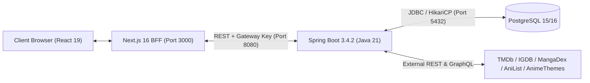
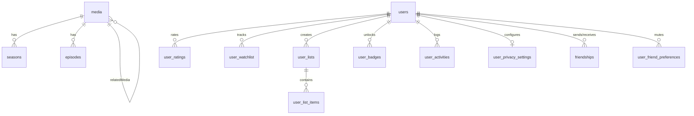
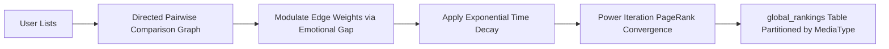

# Media Tracker: System Architecture & Deep Dive Documentation

This document serves as the definitive source of truth for the **Media Tracker** application. It is intentionally written with extreme detail and architectural depth to provide developers, system maintainers, and AI coding assistants a complete, holistic understanding of the entire multi-service codebase, its relational database design, third-party data pipelines, Spring Boot backend services, and Next.js frontend architecture.

---

## Table of Contents

1. [Core Purpose & Vision](#1-core-purpose--vision)
2. [Technology Stack & Infrastructure](#2-technology-stack--infrastructure)
3. [Database Architecture & "The Rosetta Stone"](#3-database-architecture--the-rosetta-stone)
   - [3.1 The Universal Media Table](#31-the-universal-media-table)
   - [3.2 The External ID Mapping Layer](#32-the-external-id-mapping-layer)
   - [3.3 Relational Hierarchies (Media -> Seasons -> Episodes)](#33-relational-hierarchies-media---seasons---episodes)
   - [3.4 User Profiles, Authentication & Roles](#34-user-profiles-authentication--roles)
   - [3.5 Social Graph & Privacy Settings](#35-social-graph--privacy-settings)
   - [3.6 Rating, Deep Review & Watchlist Schema](#36-rating-deep-review--watchlist-schema)
   - [3.7 Custom Lists & Global Rankings Table](#37-custom-lists--global-rankings-table)
   - [3.8 Activity Logs & Structured System Logs](#38-activity-logs--structured-system-logs)
   - [3.9 Universal Person & Company Store](#39-universal-person--company-store)
   - [3.10 Background Jobs & API Caching Layer](#310-background-jobs--api-caching-layer)
4. [Third-Party APIs & Data Pipeline Architecture](#4-third-party-apis--data-pipeline-architecture)
   - [4.1 The Movie Database (TMDb)](#41-the-movie-database-tmdb)
   - [4.2 MangaDex API](#42-mangadex-api)
   - [4.3 Internet Game Database (IGDB) via Twitch OAuth](#43-internet-game-database-igdb-via-twitch-oauth)
   - [4.4 AnimeThemes.moe API](#44-animethemesmoe-api)
   - [4.5 Jikan API (MyAnimeList v4)](#45-jikan-api-myanimelist-v4)
   - [4.6 AniList GraphQL](#46-anilist-graphql)
   - [4.7 RAWG Video Games API](#47-rawg-video-games-api)
   - [4.8 JustWatch Streaming Providers](#48-justwatch-streaming-providers)
5. [Core Application Features & Subsystems](#5-core-application-features--subsystems)
   - [5.1 Unified Media Detail Pages (/media/[id])](#51-unified-media-detail-pages-mediaid)
   - [5.2 Anime Canon & Storyline Engine](#52-anime-canon--storyline-engine)
   - [5.3 Anime Themes Engine (Seasonal vs. Continuous)](#53-anime-themes-engine-seasonal-vs-continuous)
   - [5.4 Search & Discovery Engine (/search, /discover)](#54-search--discovery-engine-search-discover)
   - [5.5 Creator & Company Profiles (/person/[id], /company/[id])](#55-creator--company-profiles-personid-companyid)
   - [5.6 Social, Friends & Real-Time Activity Feed](#56-social-friends--real-time-activity-feed)
   - [5.7 Watchlist & Deep Progress Tracking Engine](#57-watchlist--deep-progress-tracking-engine)
   - [5.8 Scoring System & Deep Reviews](#58-scoring-system--deep-reviews)
   - [5.9 Custom Lists & Global Rank Aggregation (PageRank / Elo Engine)](#59-custom-lists--global-rank-aggregation-pagerank--elo-engine)
   - [5.10 Gamification & Automated Badges](#510-gamification--automated-badges)
   - [5.11 Admin Dashboard & Maintenance Subsystem (/admin)](#511-admin-dashboard--maintenance-subsystem-admin)
6. [Project Directory & File Structure](#6-project-directory--file-structure)
7. [Environment Variables & Configuration](#7-environment-variables--configuration)
8. [Setup & Local Development](#8-setup--local-development)

---

## 1. Core Purpose & Vision

**Media Tracker** is a unified, full-stack web ecosystem engineered to serve as the definitive centralized platform for discovering, tracking, reviewing, socially comparing, and mathematically ranking all forms of entertainment media.

Traditional entertainment tracking platforms strictly isolate media into fragmented silos (e.g., Letterboxd for movies, Serializd for TV shows, MyAnimeList/AniList for anime and manga, Backloggd for video games). Media Tracker unifies these categories, treating **Movies, TV Shows, Anime, Manga, and Video Games** as first-class, interconnected citizens within a relational database and unified user experience.

Key capabilities include:
- **Universal Cross-Media Tracking:** Track progress for episodes watched, chapters/volumes read, hours played, or movies logged in a unified dashboard.
- **Multi-Provider Routing:** Instant resolution of media and creators across TMDb, MangaDex, IGDB, RAWG, AnimeThemes.moe, Jikan, and AniList.
- **Narrative Timeline Continuity:** Intelligent reconciliation of anime seasons, broadcast finale specials, and canon theatrical movies into a coherent viewing order.
- **Deep Reviews:** 1–100 score sliders paired with multi-axis criteria breakdowns tailored per media type (e.g., Narrative, Visuals, Gameplay, Audio, Cinematography).
- **Social Graph & Activity Feeds:** Bidirectional friend requests, real-time activity timelines, friend rating overlays on media pages, and granular privacy controls.
- **Global Mathematical Ranking:** A PageRank-powered graph aggregation engine that converts user tier lists into an authoritative global media leaderboard with emotional score gap multipliers and exponential time decay.
- **Enterprise-Grade Admin Panel:** Real-time PostgreSQL table statistics, user diagnostics and role assignment, cache management, job queue retries, and high-speed data wipe tools.

---

## 2. Technology Stack & Infrastructure

The application is architected as a modern decoupled multi-service system comprising a high-performance **Java Spring Boot backend** and a **Next.js frontend**.



### Backend (Spring Boot & Java 21)
- **Framework:** **Spring Boot 3.4.2** running on **Java 21 (LTS)**.
- **Concurrency:** Java 21 Virtual Threads enabled (`spring.threads.virtual.enabled: true`) for lightweight, non-blocking I/O throughput.
- **Persistence & ORM:** **Spring Data JPA** with **Hibernate 6.6** and HikariCP connection pooling.
- **Database Migrations:** **Flyway** migration manager executing versioned SQL scripts (`V1__init_schema.sql`, `V2__seed_test_users.sql`, `V3__fix_mangadex_cover_urls.sql`) on startup.
- **Security:** **Spring Security 6** with a stateless `JwtAuthenticationFilter` supporting internal gateway signatures (`X-Internal-Gateway-Key`) and role-based authority mapping (`ROLE_USER`, `ROLE_ADMIN`, `ROLE_SYSTEM`).
- **API Documentation:** Integrated **OpenAPI 3 / Swagger UI** (`/swagger-ui.html`, `/v3/api-docs`).
- **Build System:** **Gradle** with the Gradle Wrapper (`./gradlew`).

### Frontend (Next.js & React 19)
- **Framework:** **Next.js 16** utilizing the App Router paradigm, React Server Components (RSC), and Turbopack compiler.
- **Language:** **TypeScript 5** with strict type contracts across UI components, API wrappers, and server actions.
- **UI & Styling:** **React 19**, **Tailwind CSS v4** (high-contrast dark-mode glassmorphic theme), and **Lucide React** icon library.
- **Authentication:** **NextAuth.js v4** with OAuth providers (**Discord**, **Google**), integrated with backend OAuth synchronization (`/api/auth/oauth-sync`) and dynamic token role self-healing.
- **Backend Communication:** Type-safe API client (`src/lib/api-client.ts`) transparently proxying server-side requests with internal security headers.

### Database & Storage
- **Engine:** **PostgreSQL 15 / 16**, containerized via Docker (`local_postgres` on port `5432`).
- **Caching Layer:** Persistent PostgreSQL key-value caching table (`ApiCache`) with TTLs and automatic cleanup routines.

---

## 3. Database Architecture & "The Rosetta Stone"

The relational database architecture is defined by Flyway-managed PostgreSQL DDL and Spring Data JPA entities in `com.mediatracker.model.entity.*`.



### 3.1 The Universal `media` Table
Every piece of content is anchored in the `media` table:
- `id` (Text / Slug): Canonical slug identifier (e.g., `tmdb-movie-157336`, `tmdb-tv-1429`, `igdb-game-112875`, `mangadex-manga-c52b2ce3...`).
- `title` (Text): Canonical normalized title.
- `type` (`MediaType` enum: `SHOW`, `SEASON`, `EPISODE`, `MOVIE`, `GAME`, `MANGA`, `OTHER`).
- `isMainStoryline` (Boolean): Distinguishes main canonical entries from spin-offs, OVAs, or specials.
- `releaseDate` (Text): ISO date or publication year string.
- `relatedMediaId`: Self-referential relation establishing parent franchise trees, sequels, and prequels.
- `themeData` (Jsonb): Cached openings and endings `{ openings: string[], endings: string[], groups: AnimeThemeGroup[] }`.
- `watchData` (Jsonb): Cached streaming availability `{ flatrate: Provider[], rent: Provider[], buy: Provider[] }`.
- `episodeData` (Jsonb): Root season episodic metadata.
- `staffData` (Jsonb), `castData` (Jsonb), `studioData` (Jsonb): Consolidated production credits.
- `franchiseSyncedAt` (Timestamp): Timestamp of last synchronization.

### 3.2 The External ID Mapping Layer
Acting as a Rosetta Stone, the `media` table maps external provider IDs to canonical records:
- `tmdbId` (Integer, unique): Links movies, TV series, and anime to The Movie Database for high-res artwork, seasons, and episodes.
- `mangadexId` (Text, unique): UUID linking manga to MangaDex for covers, author profiles, and chapter feeds.
- `igdbId` (Integer, unique): Links video games to IGDB for platforms, genres, developers, and game engines.
- `malId` (Integer, unique): MyAnimeList ID, used to query Jikan API endpoints.
- `anilistId` (Integer, unique): AniList ID for anime/manga node graph references.

### 3.3 Relational Hierarchies (Media -> Seasons -> Episodes)
- **`seasons` Table:** Linked to parent `media` via `mediaId`. Stores `seasonNumber`, `releaseDate`, `episodeData`, `themeData`, and season-specific cast/staff JSON.
- **`episodes` Table:** Stores granular episodic records with air dates, episode numbers, runtime minutes, vote averages, and overview text.

### 3.4 User Profiles, Authentication & Roles
- **`users` Table:**
  - `id` (UUID): Primary key.
  - `name`, `username` (unique), `email` (unique), `emailVerified`, `image`.
  - `realName`, `stateRegion`, `country`.
  - `showcaseBadges` (Text[]): Array of badge IDs showcased on the user's profile.
  - `role` (Text, default: `"user"`): Role-based access control flag (`"user"`, `"admin"`).
- **OAuth Tables (`Account`, `Session`, `VerificationToken`):** Stores OAuth identity mappings from Discord and Google.

### 3.5 Social Graph & Privacy Settings
- **`friendships` Table:**
  - `sender_id`, `receiver_id` (UUIDs referencing `users(id)` with cascading delete).
  - `status` (`FriendshipStatus` enum: `PENDING`, `ACCEPTED`, `DECLINED`, `BLOCKED`).
  - `created_at`, `updated_at`.
- **`user_privacy_settings` Table:**
  - Configures visibility (`PUBLIC`, `FRIENDS_ONLY`, `PRIVATE`) for `profile_visibility`, `ratings_visibility`, `watchlist_visibility`, and `activity_visibility`.
- **`user_friend_preferences` Table:**
  - `hide_activity` (Boolean): Mutes friend activities from your home feed.
  - `hide_ratings` (Boolean): Mutes friend scores on media detail pages.

### 3.6 Rating, Deep Review & Watchlist Schema
- **`user_ratings` Table:**
  - `user_id`, `media_id` (Unique composite key).
  - `score` (Integer: 1–100).
  - `is_deep_review` (Boolean): Indicates whether multi-axis criteria scores were submitted.
  - `criteria_scores` (Jsonb): Criteria scores out of 100 (Narrative, Visuals, Gameplay, Audio, etc.).
  - `review_text` (Text): Optional markdown review text.
  - `rank_position` (Integer): Optional personal tier position.
  - `media_title`, `media_image`, `media_release_date`: Cached snapshots for instant rendering.
- **`user_watchlist` Table:**
  - `user_id`, `media_id` (Unique composite key).
  - `status` (`WatchlistStatus` enum: `PLANNING`, `IN_PROGRESS`, `COMPLETED`, `ON_HOLD`, `DROPPED`).
  - `episodesWatched` (Integer), `is_rewatching` (Boolean) - for TV Shows & Anime.
  - `chaptersRead` (Integer), `volumesRead` (Integer), `is_rereading` (Boolean) - for Manga.
  - `hoursPlayed` (Double precision), `platform` (Text) - for Video Games.
  - `watchCount` (Integer) - for Movies.
  - `started_at`, `finished_at` (Timestamps).

### 3.7 Custom Lists & Global Rankings Table
- **`user_lists` Table:**
  - `id` (UUID), `user_id`, `title` (Text), `media_type` (`MediaType`). Custom lists are strictly partitioned by media format so that Shows, Seasons, Episodes, Movies, Games, and Manga maintain isolated ranking lists.
- **`user_list_items` Table:**
  - `list_id`, `media_id`, `media_title`, `media_image`.
  - `rank_position` (Integer): 1-indexed relative placement in the custom tier list.
- **`global_rankings` Table:**
  - `media_id`, `media_type` (`MediaType`).
  - `elo_score` (Float): Weighted PageRank score.
  - `rank` (Integer): Partitioned rank position recalculated by the PageRank engine.

### 3.8 Activity Logs & Structured System Logs
- **`user_activities` Table:**
  - Social activity stream entries (`type`: `RATED_MEDIA`, `WATCHLIST_STATUS`, `EPISODES_WATCHED`, `CHAPTERS_READ`, `VOLUMES_READ`, `HOURS_PLAYED`, `FAVORITED`, `CUSTOM`).
  - Includes `media_id`, `media_title`, `media_image`, `media_type`, and `data` (Jsonb).
- **`activity_log` Table:**
  - Personal consumption audit log tracking all progress increments.

### 3.9 Universal Person & Company Store
- **`people` Table:**
  - Normalized creator records: `name`, `nativeName`, `biography`, `profileImage`, `birthDate`, `deathDate`, `knownForDepartment`, `mergedCredits` (Jsonb).
- **`companies` Table:**
  - Studios and publishers: `name`, `description`, `logoUrl`, `country`, `mergedWorks` (Jsonb).

### 3.10 Background Jobs & API Caching Layer
- **`BackgroundJob` Table:**
  - Durable task queue: `type`, `payload` (Jsonb), `status` (`pending`, `locked`, `completed`, `failed`), `attempts`, `max_attempts`, `run_at`, `last_error`.
- **`ApiCache` Table:**
  - Persistent provider cache: `id` (Text PK), `provider` (Text), `data` (Jsonb), `created_at`, `expires_at`.

---

## 4. Third-Party APIs & Data Pipeline Architecture

Media Tracker coordinates external APIs across media categories, managed by dedicated Spring Boot client services (`com.mediatracker.client.*`) and cached in PostgreSQL `ApiCache`:

| Provider | Media Formats Supported | Key Use Cases | Caching & Delivery |
| :--- | :--- | :--- | :--- |
| **The Movie Database (TMDb)** | Movies, TV Shows, Anime | Metadata, backdrops, trailers, `aggregate_credits` (full cast across seasons), episodes, JustWatch providers | 24h cache in `ApiCache`, Spring RestClient |
| **MangaDex** | Manga, Light Novels, One-shots | Manga metadata, high-resolution cover art (`uploads.mangadex.org`), author/artist bios, live scanlation chapter feeds | Direct public REST API + uploads CDN |
| **IGDB (Twitch)** | Video Games | Game metadata, covers, screenshots, release platforms, genres, game engines | Twitch OAuth app access token caching |
| **AnimeThemes.moe** | Anime TV, Movies, Specials | Opening and ending theme songs, artists, episode ranges, video streaming mirrors | Cache key `anime-themes-v4-*` (7 days) |
| **Jikan (MAL v4)** | Anime, Manga | Fallback theme songs, MyAnimeList ID translation, franchise graph relations | Rate-limited client wrapper |
| **AniList GraphQL** | Anime, Manga | Manga search fallback, franchise tree references, studio credits | GraphQL query execution with rate-limit recovery |
| **RAWG** | Video Games | Game discover search, developer team credits | 6-hour cache in `ApiCache` |
| **JustWatch (via TMDb)** | Movies, TV Shows | Regional flatrate (streaming), rent, and buy links (Netflix, Crunchyroll, Prime, Apple TV) | Ingested via TMDb `watch/providers` sub-resource |

---

## 5. Core Application Features & Subsystems

### 5.1 Unified Media Detail Pages (`/media/[id]`)
Media detail pages adapt dynamically based on the 3-part slug format resolved by Spring Boot (`GET /api/media/{slug}`):

- **Universal Slug Parsing:**
  - `tmdb-movie-[id]`: Movie details, release dates, full cast, directors, trailers, streaming providers.
  - `tmdb-tv-[id]`: TV series details, seasons, `aggregate_credits` across all seasons, and episodic metadata.
  - `igdb-[id]`: Video game information, platforms, engines, developers, screenshots.
  - `mangadex-[id]`: Manga synopsis, author/artist credits, tags, and chapter list.
- **Hero Artwork & Badges:** Ultra-high-resolution backdrops with dark gradient masking, title, Japanese/native title, release year, age ratings, runtimes, status pills, and genre badges.
- **Interactive Action Bar:**
  - **Watchlist Dropdown:** Status toggling (`Planning`, `In Progress`, `Completed`, `On Hold`, `Dropped`).
  - **Progress Tracker:** Specialized progress modal tailored per media format.
  - **Rating Button:** Opens the score slider and deep review criteria modal.
  - **Add to Custom List:** Modal to insert or re-rank the item within personal tier lists.
- **Full Cast & Crew Modal:**
  - TV shows query TMDb's `aggregate_credits` endpoint to fetch every actor across all seasons sorted by episode count.
  - Displays character portraits alongside actor headshots and role names.
- **Graceful Poster Rendering:**
  - Posters feature automatic `onError` fallback handlers that display stylized placeholders if an external asset fails to load.
- **Social Rating Overlay ("Friends Who Rated This"):** Displays friends' avatars, numerical ratings, and review snippets directly on the media page.

---

### 5.2 Anime Canon & Storyline Engine
Anime franchises often feature non-standard release structures where story arcs culminate in broadcast specials or canonical movies rather than numbered episodes. The anime engine reconciles these timelines:

- **Canon Specials Integration (`CANON_SPECIAL_RULES`):**
  - Broadcast specials (e.g., *Attack on Titan The Final Chapters Specials 1 & 2*) classified under Season 0 by external providers are automatically integrated into their canonical parent season as finale episodes (`isFinaleSpecial: true`).
- **Canon Theatrical Continuations (`CANON_FRANCHISE_MOVIES`):**
  - Maps canon movies directly into the show's narrative timeline:
    - *Jujutsu Kaisen 0* positioned before Season 1.
    - *Demon Slayer: Mugen Train* positioned between Season 1 and Entertainment District Arc.
    - *Demon Slayer: Infinity Castle* positioned after Season 5.
- **Episode Count Synchronization:** Dynamically adjusts episode counts to ensure progress bars and completion percentages reflect full narrative continuity.

---

### 5.3 Anime Themes Engine (Seasonal vs. Continuous)
The anime themes subsystem integrates **AnimeThemes.moe** with automatic fallback to **Jikan (MAL)**:

- **Seasonal Anime (e.g., *Attack on Titan*, *Demon Slayer*):**
  - Grouped into discrete season buttons (**Season 1**, **Season 2**, **Season 3**, **The Final Season**).
  - Movies and OVAs are segregated into appropriate views.
  - Broadcast specials map into their parent seasons (e.g., *The Final Season* captures all corresponding OPs/EDs).
- **Continuous Anime (e.g., *One Piece*, *Bleach*):**
  - Displays interactive selector buttons for exact episode broadcast windows (`1-47`, `48-115`, `116-168`).
  - Overlapping endings are aligned with their broadcast window.
- **Dedicated Movie Theme Isolation:** Standalone movie pages display only that film's specific theme tracks.

---

### 5.4 Search & Discovery Engine (`/search`, `/discover`)
- **Multi-Tab Search:** Unified search across **All Media**, **Movies**, **Shows**, **Games**, **Manga**, and **Users**.
- **Direct MangaDex Search:** Queries MangaDex API with English titles, publication years, and 512px cover artwork.
- **Search Navigation Retention:** Remembers full query and tab state in `sessionStorage` so users can return directly to their results.
- **Discover Page (`/discover`):** Filter by genre, release year, and sort order (Popularity, Highest Rated, Newest) across formats.

---

### 5.5 Creator & Company Profiles (`/person/[id]`, `/company/[id]`)
- **Direct Resolution:** Resolves creator and studio profiles by identifier (`tmdb-[id]`, `mangadex-[uuid]`, `igdb-[id]`, `anilist-[id]`, `rawg-[id]`).
- **Creator Catalogs:** Displays filmographies, ludographies, and bibliographies with covers and roles.
- **Company & Studio Profiles:** Displays production houses (MAPPA, Ufotable, Bones) and publishers with their released works.

---

### 5.6 Social, Friends & Real-Time Activity Feed
- **Friend Request Lifecycle:** Send requests by username, accept, decline, block, or remove friends.
- **Real-Time Activity Feed (`FriendActivityFeed.tsx`):** Displays a chronological feed of friends' actions:
  - Rated a media item with score and criteria breakdown.
  - Updated watchlist status (Started, Finished, Dropped).
  - Incremented progress (watched episodes, read chapters/volumes, logged hours).
- **Privacy Settings:** Granular visibility controls (`Public`, `Friends Only`, `Private`) for profile, ratings, watchlist, and activity.
- **Username Onboarding Flow:** Prompts new OAuth accounts to choose a unique username upon first login.

---

### 5.7 Watchlist & Deep Progress Tracking Engine
Specialized tracking controls tailored per media format:
- **Five Standard States:** `PLANNING`, `IN_PROGRESS`, `COMPLETED`, `ON_HOLD`, `DROPPED`.
- **TV Shows & Anime:** "+1 Episode" increment button with progress bar and rewatching counter.
- **Manga:** Dual counters for **Chapters Read** and **Volumes Read**, rereading toggles, and live chapter reader.
- **Video Games:** Decimal hours tracker (e.g., `45.5h played`) and platform selector (PC, PlayStation 5, Xbox Series X/S, Switch).
- **Movies:** Rewatch counter for logged viewings.

---

### 5.8 Scoring System & Deep Reviews
- **1–100 Score Slider:** Color-coded score tiers:
  - **95 – 100:** Gold (`#FACC15`)
  - **75 – 94:** Vibrant Green (`#4ADE80`)
  - **50 – 74:** Sky Blue (`#60A5FA`)
  - **25 – 49:** Neutral Grey (`#9CA3AF`)
  - **1 – 24:** Charcoal (`#374151`)
- **Deep Review Multi-Axis Criteria:**
  - **Video Games:** Narrative, Gameplay, Visuals & Graphics, Performance, Audio & Soundtrack.
  - **Movies:** Narrative, Cinematography, Sound & Score, Acting Performances.
  - **TV Shows & Seasons:** Narrative, Cinematography, Sound & Score, Acting Performances, Ending.
  - **Manga:** Narrative, Art Style, Characters, Character Development.
- **Community Criteria Averages:** Aggregated comparative bar charts rendered directly on media pages.

---

### 5.9 Custom Lists & Global Rank Aggregation (PageRank / Elo Engine)
Users can construct custom ordered tier lists (e.g., "Top 10 Anime of All Time", "Best RPGs") and arrange items into ranked positions.

The Spring Boot backend (`PageRankAggregationService.java`) aggregates these lists into global leaderboards:



1. **Pairwise Comparison Graph:** Every item in a user list is compared against every item ranked below it, creating directed edges from lower-ranked items ($L$) to higher-ranked items ($W$).
2. **Emotional Score Gap Multiplier:**
   $$\text{gapMultiplier} = 1.0 + \left(\frac{|Score_W - Score_L|}{100}\right) \times 0.2$$
3. **Exponential Time Decay:**
   $$\text{decay} = 0.5^{\frac{\text{daysOld}}{\text{HALF\_LIFE\_DAYS}}}$$
   $$\text{edgeWeight} = \text{gapMultiplier} \times \max(0.5, \text{decay})$$
4. **Power Iteration PageRank Convergence:** Solved with damping factor $d = 0.85$ and convergence threshold $0.00001$.
5. **Partitioned Leaderboards:** Normalized ranks are stored in `global_rankings` partitioned by `media_type` (`SHOW`, `SEASON`, `EPISODE`, `MOVIE`, `GAME`, `MANGA`), ensuring independent global standings.

---

### 5.10 Gamification & Automated Badges
- **Milestone Evaluation:** Automated badge unlocking based on logging milestones (e.g., 100 Anime Watched, 50 Manga Read, 25 Games Played).
- **Showcase Badges:** Users can pin up to 3 unlocked badges to their public profile header.

---

### 5.11 Admin Dashboard & Maintenance Subsystem (`/admin`)
Users with `role = "admin"` have access to internal diagnostic tools:
- **System Overview (`/admin`):** Real-time metric cards for users, media, ratings, reviews, cache entries, and jobs.
- **PageRank Aggregation:** Interactive trigger button executing `POST /api/admin/ranking` to recalculate leaderboards on demand.
- **User Lookup & Management (`/admin/users`, `/admin/users/[userId]`):** Inspect account details, activity counts, and assign or revoke `admin` privileges.
- **Database Statistics (`/admin/database`):** Real-time table row counts directly from PostgreSQL via `GET /api/admin/database/summary`.
- **Database Wipe Engines:**
  - **Admin Nuke ("NUKE DATABASE"):** Protected wipe button executing `POST /api/admin/nuke`.
  - **App Drawer Reset:** Convenience button executing `POST /api/debug/wipe-db`.
  - **Session Preservation:** High-speed SQL truncation across all 21 application tables while safely preserving `users`, `Account`, `Session`, and `VerificationToken` so logins and admin permissions survive the wipe.
- **Background Jobs (`/admin/jobs`):** Monitor task queue statuses, inspect failure stack traces, and retry failed jobs.
- **Cache Inspector (`/admin/cache`):** View cache freshness and purge expired entries via `POST /api/admin/cache/cleanup`.

---

## 6. Project Directory & File Structure

```
media-tracker/
├── backend/                               # Spring Boot Application (Java 21)
│   ├── build.gradle                       # Gradle dependencies and build configuration
│   ├── gradlew.bat / gradlew              # Gradle wrappers
│   └── src/main/
│       ├── java/com/mediatracker/
│       │   ├── MediaTrackerApplication.java # Spring Boot entry point
│       │   ├── client/                    # Third-party API REST & GraphQL clients
│       │   │   ├── AnilistClient.java
│       │   │   ├── AnimeThemesClient.java
│       │   │   ├── IgdbClient.java
│       │   │   ├── JikanClient.java
│       │   │   ├── MangaDexClient.java
│       │   │   ├── RawgClient.java
│       │   │   └── TmdbClient.java
│       │   ├── controller/                # Spring REST controllers
│       │   │   ├── AdminController.java   # Admin diagnostics, jobs, cache, nuke, ranking
│       │   │   ├── AuthController.java    # OAuth user synchronization (/api/auth/oauth-sync)
│       │   │   ├── CustomListController.java # User custom tier lists
│       │   │   ├── DiscoverController.java # Media discovery by genre & year
│       │   │   ├── FriendController.java  # Friendships & activity feed
│       │   │   ├── MediaController.java   # Media resolution & episodic metadata
│       │   │   ├── ProfileController.java # User profiles, nicknames & privacy
│       │   │   ├── RankingController.java # Global leaderboards & ranking save
│       │   │   ├── RatingController.java  # User ratings & deep review criteria
│       │   │   ├── SearchController.java  # Multi-provider unified search
│       │   │   └── WatchlistController.java # Watchlist progress tracking
│       │   ├── model/
│       │   │   ├── dto/                   # Data Transfer Objects
│       │   │   ├── entity/                # JPA Entity definitions
│       │   │   └── enums/                 # Domain enumerations (MediaType, WatchlistStatus)
│       │   ├── repository/                # Spring Data JPA repositories
│       │   ├── security/                  # Spring Security, JWT & Gateway filter
│       │   ├── service/                   # Core business logic services
│       │   │   ├── ActivityService.java
│       │   │   ├── AdminWipeService.java
│       │   │   ├── AnimeCanonService.java
│       │   │   ├── AuthService.java
│       │   │   ├── BadgeService.java
│       │   │   ├── CacheService.java
│       │   │   ├── FriendshipService.java
│       │   │   ├── ListService.java
│       │   │   ├── MediaService.java
│       │   │   ├── PageRankAggregationService.java
│       │   │   ├── ProfileService.java
│       │   │   ├── RatingService.java
│       │   │   └── WatchlistService.java
│       │   └── worker/                    # Background job queue manager & processors
│       └── resources/
│           ├── application.yml            # Spring configuration & datasource profiles
│           └── db/migration/              # Flyway database migrations
│               ├── V1__init_schema.sql    # DDL schema definition
│               ├── V2__seed_test_users.sql # Seed test data
│               └── V3__fix_mangadex_cover_urls.sql # Cover art URL corrections
├── frontend/                              # Next.js Application (React 19)
│   ├── package.json                       # Dependencies & scripts
│   ├── next.config.ts                     # Next.js configuration
│   ├── tailwind.config.ts                 # Tailwind styling rules
│   └── src/
│       ├── app/
│       │   ├── admin/                     # Admin dashboard pages
│       │   │   ├── cache/                 # Cache inspector UI
│       │   │   ├── database/              # Database row counts & Nuke UI
│       │   │   ├── jobs/                  # Background jobs monitor
│       │   │   ├── logs/                  # System logs viewer
│       │   │   ├── media/                 # Media catalog diagnostics
│       │   │   ├── performance/           # Latency monitoring
│       │   │   └── users/                 # User role management
│       │   ├── api/                       # Next.js BFF route handlers (auth, proxying)
│       │   ├── company/[id]/              # Studio / publisher detail pages
│       │   ├── discover/                  # Media discovery page
│       │   ├── media/[id]/                # Universal media detail pages
│       │   ├── person/[id]/               # Creator profile pages
│       │   ├── profile/                   # Current user profile & friends manager
│       │   ├── rankings/                  # Global leaderboard pages
│       │   ├── search/                    # Unified multi-tab search page
│       │   └── user/[username]/           # Public user profile pages
│       ├── components/                    # Reusable React UI components
│       │   ├── AnimeThemes.tsx            # Anime opening/ending theme player
│       │   ├── AppDrawer.tsx              # Navigation drawer & quick-wipe trigger
│       │   ├── CustomListsManager.tsx     # Drag-and-drop custom tier list manager
│       │   ├── FriendActivityFeed.tsx     # Chronological friend activity stream
│       │   ├── FriendsManager.tsx         # Friend request manager
│       │   ├── FriendsRatingSection.tsx   # "Friends Who Rated This" widget
│       │   ├── RatingSlider.tsx           # 1-100 rating slider & deep review criteria
│       │   ├── SearchResultsTabs.tsx      # Multi-type search results
│       │   └── WatchlistProgressTracker.tsx # Specialized progress incrementer
│       └── lib/
│           ├── admin-api.ts / admin-auth.ts # Admin authentication utilities
│           ├── admin-cache.ts             # Admin cache statistics connector
│           ├── admin-database.ts          # Real-time database metrics connector
│           ├── admin-jobs.ts              # Background job client connector
│           ├── api-client.ts              # Type-safe Spring Boot API client
│           └── auth.ts                    # NextAuth configuration & token sync
├── docker-compose.yml                     # PostgreSQL & local services definition
└── README.md                              # System architecture documentation
```

---

## 7. Environment Variables & Configuration

### Frontend Configuration (`frontend/.env.local` or root `.env`)
```env
# Next.js & NextAuth Configuration
NEXTAUTH_URL="http://localhost:3000"
NEXTAUTH_SECRET="your-secure-nextauth-secret"

# Internal Gateway Bridge (must match backend app.gateway.secret)
INTERNAL_GATEWAY_SECRET="default-internal-secret-change-in-prod-123456"

# Spring Boot Backend URL
NEXT_PUBLIC_API_URL="http://localhost:8080/api"

# OAuth Providers
DISCORD_CLIENT_ID="your-discord-client-id"
DISCORD_CLIENT_SECRET="your-discord-client-secret"
GOOGLE_CLIENT_ID="your-google-client-id"
GOOGLE_CLIENT_SECRET="your-google-client-secret"

# Optional Client-Side Provider Keys
TMDB_API_KEY="your-tmdb-api-key"
TWITCH_CLIENT_ID="your-twitch-client-id"
TWITCH_CLIENT_SECRET="your-twitch-client-secret"
RAWG_API_KEY="your-rawg-api-key"
```

### Backend Configuration (`backend/src/main/resources/application.yml`)
```yaml
server:
  port: 8080

spring:
  application:
    name: media-tracker-backend
  datasource:
    url: ${SPRING_DATASOURCE_URL:jdbc:postgresql://localhost:5432/media_app}
    username: ${SPRING_DATASOURCE_USERNAME:admin}
    password: ${SPRING_DATASOURCE_PASSWORD:localpassword123}
  threads:
    virtual:
      enabled: true
  flyway:
    enabled: true
    baseline-on-migrate: true
    baseline-version: 1
    locations: classpath:db/migration

app:
  gateway:
    secret: ${INTERNAL_GATEWAY_SECRET:default-internal-secret-change-in-prod-123456}
  providers:
    tmdb:
      apiKey: ${TMDB_API_KEY:}
    twitch:
      clientId: ${TWITCH_CLIENT_ID:}
      clientSecret: ${TWITCH_CLIENT_SECRET:}
    rawg:
      apiKey: ${RAWG_API_KEY:}
```

---

## 8. Setup & Local Development

### 1. Prerequisites
- **Java:** JDK 21 or later installed (`java -version`).
- **Node.js:** version 20.x or later (`node -v`).
- **Docker:** Docker Desktop running locally.

### 2. Start PostgreSQL Database
Start the containerized PostgreSQL instance via Docker Compose:
```bash
docker-compose up -d
```
Verify that the `local_postgres` container is healthy on port `5432`:
```bash
docker ps
```

### 3. Build & Run the Spring Boot Backend
From the `backend/` directory:
```bash
# On Windows PowerShell:
cd backend
.\gradlew.bat bootRun

# Or build the executable JAR:
.\gradlew.bat bootJar -x test
java -jar build/libs/media-tracker-backend-0.0.1-SNAPSHOT.jar
```
Flyway will automatically execute all database migrations (`V1`, `V2`, `V3`).
The backend will be live on [http://localhost:8080](http://localhost:8080), with Swagger documentation at [http://localhost:8080/swagger-ui.html](http://localhost:8080/swagger-ui.html).

### 4. Install & Run the Next.js Frontend
In a separate terminal, navigate to `frontend/`:
```bash
cd frontend
npm install
npm run dev
```
Open [http://localhost:3000](http://localhost:3000) in your browser.

### 5. Grant Admin Privileges
To grant `admin` permissions to your user account, execute SQL directly against PostgreSQL:
```bash
docker exec -it local_postgres psql -U admin -d media_app -c "UPDATE users SET role = 'admin' WHERE username = 'your_username';"
```
*(NextAuth dynamically refreshes roles on the next request, instantly unlocking `/admin` access)*.

### 6. Trigger PageRank Recalculation
- **Via Admin UI:** Navigate to `/admin` and click **"Calculate PageRanks"**.
- **Via REST API:**
  ```bash
  curl -X POST "http://localhost:8080/api/admin/ranking" \
    -H "X-Internal-Gateway-Key: default-internal-secret-change-in-prod-123456" \
    -H "X-User-Role: admin"
  ```

### 7. Reset Application Data ("Nuke")
To purge application media data while preserving user accounts, logins, and admin roles:
- Navigate to `/admin/database` and click **"NUKE DATABASE"**.
- Or use the slide-out navigation drawer button (**"Wipe All Local Data"**).
